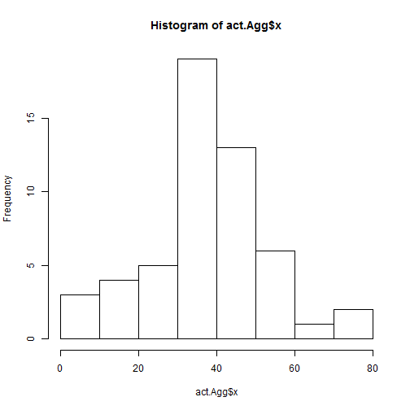
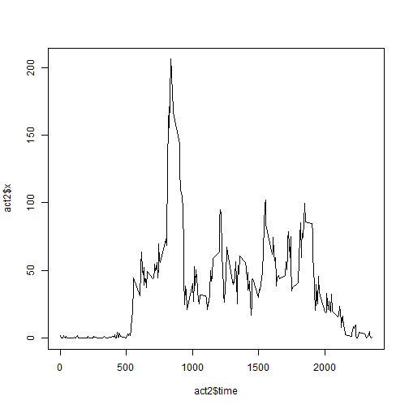
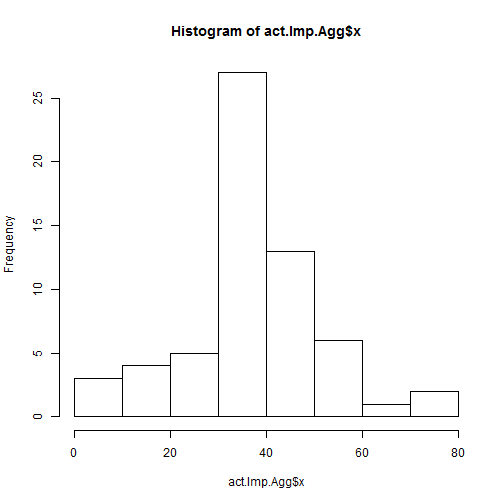
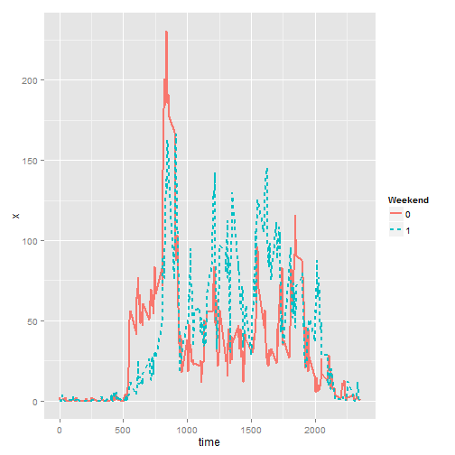
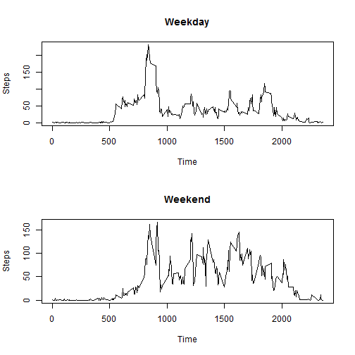

# Loading and preprocessing the data


```r
setwd ("C:/Users/matti/Desktop/Reproducible research MOOC")
act <- read.csv ("activity.csv")

str(act)
```

```
## 'data.frame':	17568 obs. of  3 variables:
##  $ steps   : int  NA NA NA NA NA NA NA NA NA NA ...
##  $ date    : Factor w/ 61 levels "2012-10-01","2012-10-02",..: 1 1 1 1 1 1 1 1 1 1 ...
##  $ interval: int  0 5 10 15 20 25 30 35 40 45 ...
```

```r
summary(act)
```

```
##      steps                date          interval     
##  Min.   :  0.00   2012-10-01:  288   Min.   :   0.0  
##  1st Qu.:  0.00   2012-10-02:  288   1st Qu.: 588.8  
##  Median :  0.00   2012-10-03:  288   Median :1177.5  
##  Mean   : 37.38   2012-10-04:  288   Mean   :1177.5  
##  3rd Qu.: 12.00   2012-10-05:  288   3rd Qu.:1766.2  
##  Max.   :806.00   2012-10-06:  288   Max.   :2355.0  
##  NA's   :2304     (Other)   :15840
```

```r
attach(act)
```

```
## The following objects are masked from act (pos = 6):
## 
##     date, interval, steps
```


```r
act.Agg <- aggregate(act$steps, list(time=act$date), mean)

act2 <- aggregate(act$steps, list(time = act$interval), mean, na.rm=T)
head(act2)
```

```
##   time         x
## 1    0 1.7169811
## 2    5 0.3396226
## 3   10 0.1320755
## 4   15 0.1509434
## 5   20 0.0754717
## 6   25 2.0943396
```

```r
tail(act2)
```

```
##     time         x
## 283 2330 2.6037736
## 284 2335 4.6981132
## 285 2340 3.3018868
## 286 2345 0.6415094
## 287 2350 0.2264151
## 288 2355 1.0754717
```
# Total number of steps taken per day?

## histogram:


```r
hist(act.Agg$x)
```

 


## Mean of steps:

```r
mean(act.Agg$x, na.rm=T)
```

```
## [1] 37.3826
```

## Median of steps:


```r
median(act.Agg$x, na.rm=T)
```

```
## [1] 37.37847
```

# What is the average daily activity pattern?


```r
plot (act2$x ~ act2$time, type="l")
```

 

Activity begins shortly after 5am, and there's a peak around 9am. 


##Which 5-minute interval, on average across all the days in the dataset, contains the maximum number of steps?##


```r
act2$time[which(act2$x == max(act2$x))]
```

```
## [1] 835
```

# Missing values

## Total number of missing values in the dataset


```r
sum(is.na(act$date))
```

```
## [1] 0
```

```r
sum(is.na(act$steps))
```

```
## [1] 2304
```

```r
sum(is.na(act$interval))
```

```
## [1] 0
```

Create a new dataset that is equal to the original dataset but with the missing data filled in.
    

```r
if(!require(plyr)){install.packages('plyr')} 
library(plyr)

impute.mean <- function(x) replace(x, is.na(x), mean(x, na.rm = TRUE))
act.Imp <- (ddply(act, ~ interval, transform, steps = impute.mean(steps)))
act.Imp.Agg <- aggregate(act.Imp$steps, list(time=act.Imp$date), mean)
act.Imp2 <- aggregate(act.Imp$steps, list(time = act.Imp$interval), mean, na.rm=T)
```
Make a histogram of the total number of steps taken each day and Calculate and report the mean and median total number of steps taken per day. Do these values differ from the estimates from the first part of the assignment? What is the impact of imputing missing data on the estimates of the total daily number of steps?

**histogram:**


```r
hist(act.Imp.Agg$x)
```

 


**Mean of steps:**

```r
mean(act.Imp.Agg$x)
```

```
## [1] 37.3826
```

```r
# difference:
mean(act.Agg$x, na.rm=T) - mean(act.Imp.Agg$x, na.rm=T)
```

```
## [1] 0
```

**Median of steps:**


```r
median(act.Imp.Agg$x)
```

```
## [1] 37.3826
```

```r
# difference:
median(act.Imp.Agg$x, na.rm=T) - median(act.Agg$x, na.rm=T)
```

```
## [1] 0.004127358
```

# What is the average daily activity pattern?


```r
plot (act.Imp2$x ~ act.Imp2$time, type="l")
```

 

***Are there differences in activity patterns between weekdays and weekends?***


```r
act.Imp$Weekend <- 0

act.Imp$Weekend[which(weekdays(as.POSIXct(act.Imp$date)) == "Sunday")] <- 1

act.Imp$Weekend[which(weekdays(as.POSIXct(act.Imp$date)) == "Saturday")] <- 1

act.Imp2 <- aggregate(act.Imp$steps, list(time = act.Imp$interval, Weekend=act.Imp$Weekend), mean, na.rm=T)

act.Imp2$Weekend <- as.factor(act.Imp2$Weekend)
```


```r
if(!require(ggplot2)){install.packages('ggplot2')} 
library(ggplot2)

ggplot(data=act.Imp2, aes(x=time, y=x, group=Weekend, colour=Weekend)) +
    geom_line(aes(linetype=Weekend), size=1)
```

 

```r
par(mfrow=c(2,1))
plot(act.Imp2$x[which(act.Imp2$Weekend==0)] ~ act.Imp2$time[which(act.Imp2$Weekend==0)], type="l", main = "Weekday", xlab = "Time", ylab = "Steps")
plot(act.Imp2$x[which(act.Imp2$Weekend==1)] ~ act.Imp2$time[which(act.Imp2$Weekend==1)], type="l", main = "Weekend", xlab = "Time", ylab = "Steps")
```

 
